<!-- edit name1 and name2 in the YAML above -->

```{r setup, include=FALSE}
options(htmltools.dir.version = FALSE)
knitr::opts_chunk$set(warning = FALSE, message = FALSE)
```

# Statistics and Bioinformatics Unit (UEB)

```{r echo=FALSE, out.width="100%", fig.align='center'}

```

.center[
.font150[
[http://ueb.vhir.org](http://ueb.vhir.org)
]
]
---

# Outline of the talk

- Why this pill (some examples)
- Some basic ideas we have all heard about
- What about significance (p-values)
- Correlation false-friends
    + _Regression, Relation, Agreement, Spurious, Ecological phallacy, Causation_
- Moving forward 
    + More dimensions, More methods ...
- Wrap-up

---

# Motivation (_Why this pill_)

- Everybody uses the term correlation, in science and normal life.


```{r echo=FALSE, out.width="80%", fig.align='center'}
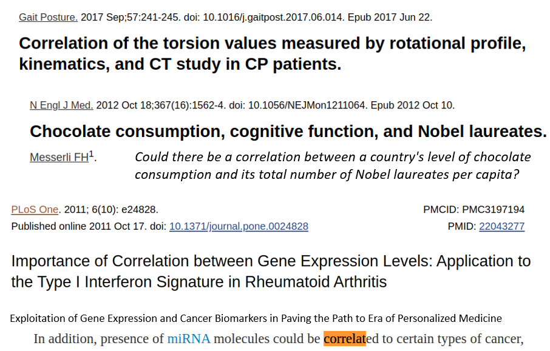
```

---

# Motivation (_Why this pill_)

.pull-left[

- The concept, however is often misused or abused.
    - Correlation used instead of agreement
    - Regression used when there is no dependent/independent variables
    - Significance applied when assumptions do not hold.
]

.pull-right[
```{r echo=FALSE, out.width="90%", fig.align='center'}
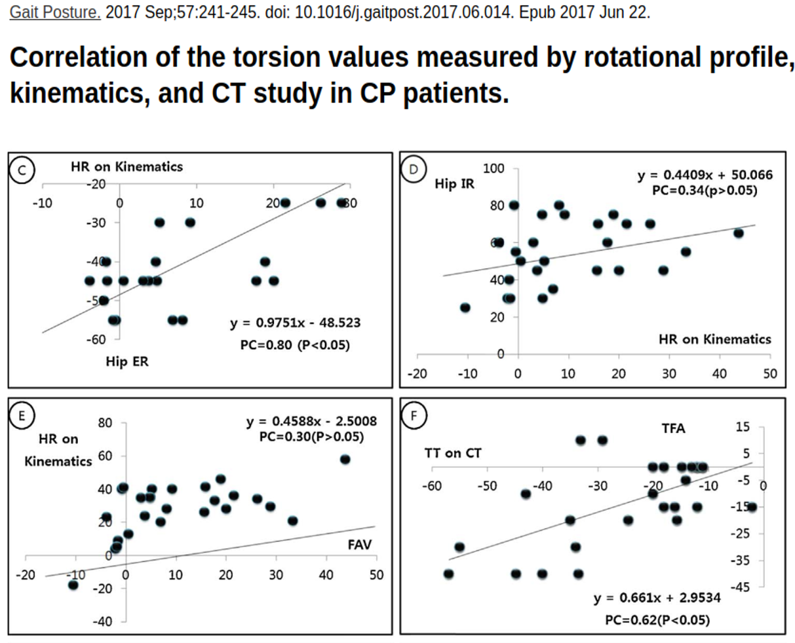
```
]

.center[
 __It may be worth to review a few concepts!__
]

---

# But what is correlation?

- In statistics, __dependence__ or __association__ is _any statistical relationship, whether causal or not, between two (random) variables_. 
- In the broadest sense __correlation__ is _any statistical association_, though 
- it commonly refers to _the degree to which a pair of variables are linearly related_ (Pearson correlation coefficient).

---

# Association can take many forms

```{r echo=FALSE, out.width="90%", fig.align='center'}
knitr::include_graphics("images/Correlation_examples1.WKP.png")
```

---

# Example: Body fat and measures

```{r, echo=FALSE, message=FALSE}
library(XML)
url <- "http://wiki.stat.ucla.edu/socr/index.php/SOCR_Data_BMI_Regression"
BMI_parsed <- htmlParse(url)
BMI_table <- readHTMLTable(BMI_parsed, which = 2) 
for (i in 1:ncol(BMI_table)) BMI_table[,i] <- as.numeric(BMI_table[,i])
BMI_table2 <- BMI_table[BMI_table$BodyFatSiriEqu < 100,]
BMI_table3<- BMI_table2[1:30,c(2:4,11:15)]
```

```{r, echo=FALSE, fig.align='center'}
require(GGally)
ggpairs(BMI_table3)
```

---

# Reviewing correlation coefficients 

## What's in my toolbox?

- Pearson (linear) correlation coefficient
- Sperman (ranks) correlation coefficient
- Kendall's tau
- Intraclass correlation coefficients
- Many other: Distance correlation, M

---

# Pearson correlation coefficient

- Most commonly used correlation coefficient
- Measures the degree of __linear__ relation between a pair of _quantitative_ variables.
- It takes values between +1 and −1, where 1 is total positive linear correlation, 0 is no linear correlation, and −1 is total negative linear correlation. 

```{r echo=FALSE, out.width="80%", fig.align='center'}
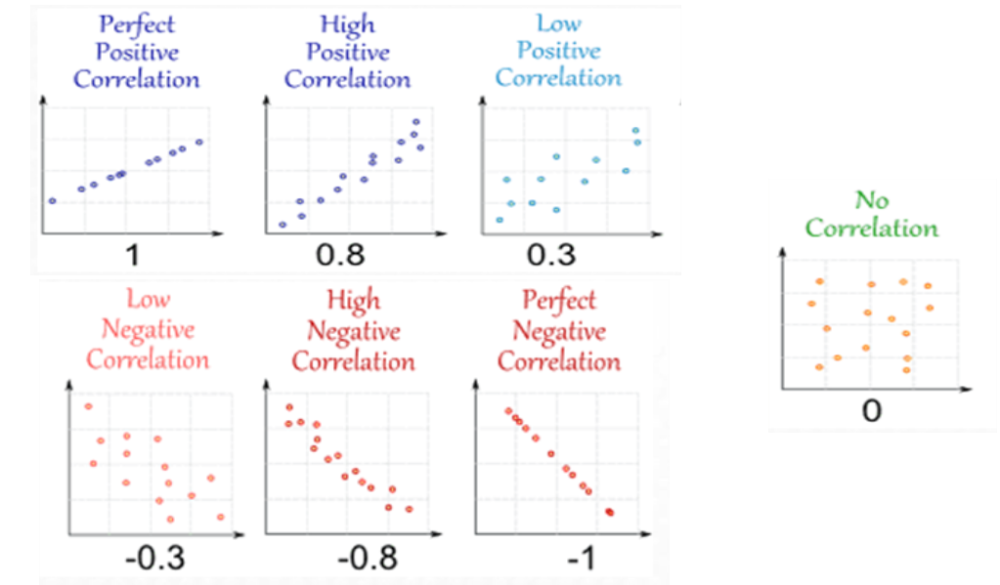
```

---

# Pearson CC measures linear association

- Pearson CC changes with noise
- It is not affected by changes in slope
- If relation is not linear it becomes useless

```{r echo=FALSE, out.width="90%", fig.align='center'}
knitr::include_graphics("images/Correlation_examples2.WKP.png")
```

---
# Spearman correlation

- If the relation is _monotone_ or the variables are in an _ordinal scale_ use _Spearman Ranks Correlation Coefficient_ instead of Pearson's.

```{r, echo=FALSE}
age<-c(23,33,27,28,29,39,41,45,30,50,53,36,54,56,57,58,59,60,61)
percFat <- c(9.5,27.9,17.8,18.7,23,31.4,25.9,34,25.2,31.1,34.7,32.0,29.1,32.5,30.3,33.0,33.8,31.5,34.5)
bodyFat<- data.frame(age,percFat)
bodyFat <- bodyFat[order(bodyFat$age),]
reg<-lm(percFat ~ age, data = bodyFat)
coeff=coefficients(reg)
```

.pull-left[
```{r, echo=FALSE}
# require(DT)
# head(bodyFat) %>% 
#   datatable()
require(magrittr)
require(kableExtra)
aTable<- kableExtra::kable(bodyFat, format="markdown")
kable_styling(aTable, "striped", position = "center", font_size = 11)
```
]

.pull-right[

```{r, echo=FALSE}
sp<- ggplot(bodyFat, aes(x=age, y=percFat)) + geom_point()
sp
```
Based on - Maze et al (1984).
]


---

# Relation is monotonic, but not linear

```{r, echo=FALSE, fig.align='center'}
sp + geom_abline(intercept = coeff[1], slope=coeff[2]) + stat_smooth()
```

---

# Spearman CC is based on __ranks__

.pull-left[
```{r, echo=FALSE}
rankAge= rank(age)
rankFat=rank(percFat)
bodyFatWithRanks <- data.frame(age, rankAge, percFat, rankFat )
bodyFatWithRanks<- bodyFatWithRanks[order(bodyFatWithRanks$age),]
aTable<- kableExtra::kable(bodyFatWithRanks)
kable_styling(aTable, "striped", position = "center", font_size = 11)
```
]
.pull-right[

__Spearman CC = Pearson CC computed on ranks__

```{r}
cor(age,bodyFat, 
    method = "spearman")[2]
cor(rankAge, rankFat,
    method = "pearson")
```
]

---

# So what? Pearson or Spearman?

- Start with a plot
- If the relation ship is _approximately_ linear you can use Pearson CC.
- If the relation is not linear but it is _monotonically increasing- or _monotonically decreasing_ you better use Spearman CC.

- The measurement scale is also a criteria 

    - Use Pearson if the data is in an "interval" or "quotient" scale
    - Use Spearman if the data are on an "ordinal" scale

---

# Review : Measurement scales

```{r echo=FALSE, out.width="100%", fig.align='center'}
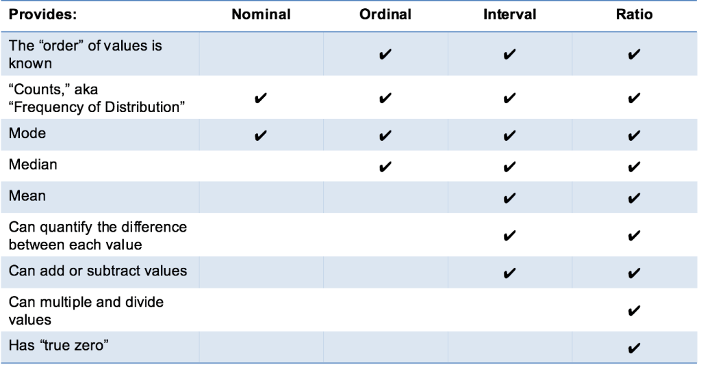
```

---


# Significance of correlation

<br>

<br>

.pull-left[
- Common correlation analysis report
    - An estimate of correlation
    - A least squares straight line
    - A significance p-value
    
- Is everything appropriate?
]

.pull-right[
```{r echo=FALSE, out.width="100%", fig.align='center'}
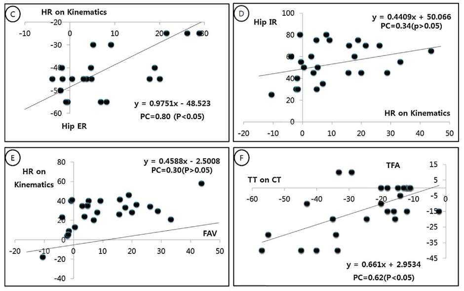
```
]

---

# Can we make inferences on correlation?

.pull-left[

- Statistical inference deals with inferring properties in population characteristics from representative samples.

```{r echo=FALSE, out.width="100%", fig.align='center'}
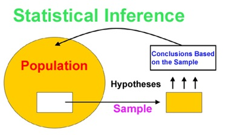
```
]

.pull-right[

When dealing with correlation it means answering questions such as:

- What is the estimated correlation coefficient of the population?
    - How precise is this estimate?
- Is there any correlation in the population, or is the sample correlation just the luck of the draw?

]

---

# Can we put a p-value on _r_?

- It is possible to make some inferences on the population correlation coefficient, $\rho$.

- It is not so straightforward as computing the sample correlation coefficient $r$.

- For the p-value to be "valid" some assumptions must hold:
    - WE have continuous variables in an interval or quotient scale, with no outliers.
    - Data comes from a simple random sample
    - From a bivariate normal distribution
    
- If these assumptions hold it is possible to tests the hypotheses:
$$
H_0:\, \rho=0,\mbox{ vs } \rho \neq 0.
$$

---

# Example

.pull-left[
<br>
<br>
```{r, echo=FALSE}
require(Hmisc)
colnames(BMI_table3)<- substr(colnames(BMI_table3),1,7)
res<- rcorr(as.matrix(BMI_table3[,1:5]))
result<- res[[1]]
for (i in 1:nrow(result))
  for(j in i:ncol(result))
    if (j > i) result[i,j]<- res[[3]][i,j]
round(result,3)
```
- Correlation matrix (below) with 
- significance values (above)
]

.pull-right[
```{r, echo=FALSE}
library(corrplot)
corrplot(res$r, type="upper",  
         p.mat = res$P, sig.level = 0.01, insig = "blank")
```
- Correlation depicted by circle size
- Significance: Values above threshold left blank
]

---

# What does this test tell?

- Correlation significance test __tells nothing about how big the population correlation is__.
- It only informs about if __it can be considered to be distinct than zero__.
- Besides this it can only be considered valid if the assumptions hold.
- And, if it were not enough, results are __very sensitive to sample size__
    - Something not significant for small sample size.
    - Becomes significant as sample size increases.
- In summary: _Too much effort for a very small prize?_


## Confidence intervals for $\rho$

- A better alternative: __Compute confidence intervals for the correlation coefficient__.
    - Again validity of assumptions is an additional difficulty
    - However it is possible to obtain good approximations based on computational intensive approximations such as the __bootstrap__.

```{r, echo=FALSE}
# ++++++++++++++++++++++++++++
# flattenCorrMatrix
# ++++++++++++++++++++++++++++
# cormat : matrix of the correlation coefficients
# pmat : matrix of the correlation p-values
flattenCorrMatrix <- function(cormat, pmat) {
  ut <- upper.tri(cormat)
  data.frame(
    row = rownames(cormat)[row(cormat)[ut]],
    column = rownames(cormat)[col(cormat)[ut]],
    cor  =(cormat)[ut],
    p = pmat[ut]
    )
}
```
---

# Correlation coefficient CI example


```{r echo=FALSE, out.width="80%", fig.align='center'}
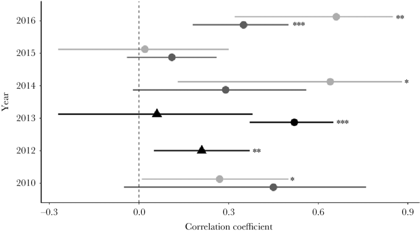
```

- Correlation coefficient with respective 95% confidence interval of mean body surface affected by a chronic dermathological disease. 
- Correlation coefficients are given for each year and are separated by work type. 
- The black dotted line represents zero correlation. Significant correlations are marked with $*$ P < 0.05, $**$ P < 0.01 and $***$ P < 0.001. 

---

# False friends (1): Regression

- Correlation and regression are often presented together.
- They are related, but they are not the same:

```{r echo=FALSE, out.width="90%", fig.align='center'}
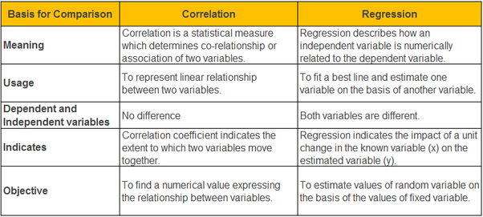
```

---

# One correlation vs two regressions

```{r echo=FALSE, out.width="100%", fig.align='center'}
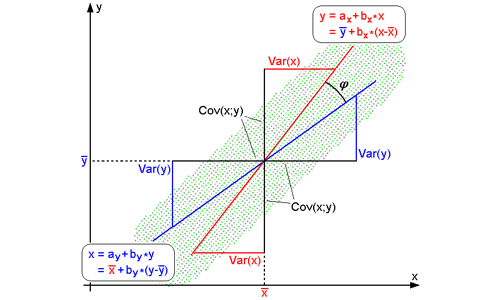
```

```{r echo=FALSE, out.width="100%", fig.align='center'}
osteo<-  read.delim("datasets/osteoporosis.txt")
osteo50 <- as.data.frame(as.matrix(osteo[1:51,c(4,6,7,8,9)]))
require(magrittr)
osteo50 <- osteo50[osteo50$peso <100,]
# sp<- ggplot(osteo50[,c(1,5)], aes(x=edad, y=imc)) + geom_point()
# sp
# reg1 <-lm(imc ~ edad, data = osteo50)
# coeff=coefficients(reg1)
# reg2 <-lm(edad ~ imc, data = osteo50)
# coeff2=coefficients(reg2)
# sp + geom_abline(intercept = coeff[1], slope=coeff[2]) + geom_abline(intercept = coeff2[1], slope=coeff2[2])
```

---

# False friends (2): Class comparison

- Is there correlation between disease and expression of a certain biomarker gene?
    - OK to compute Pearson CC  between `Expression` and `Apoptosis` and say "There is"/"There isn't"
    - Not OK to test differences between `HIGH` and `LOW` and say "There is"/"There isn't"
    
.pull-left[
```{r, echo=FALSE}
library(readxl)
library(kableExtra)
GExpressionVSApoptosis <- read_excel("datasets/GExpressionVSApoptosis.xls")
aTable<- kableExtra::kable(GExpressionVSApoptosis)
kable_styling(aTable, "striped", position = "center", font_size = 10)
```
]
.pull-right[
```{r echo=FALSE, fig.align='center'}
expres <- as.data.frame(as.matrix(GExpressionVSApoptosis[,1:2]))
sp<- ggplot(expres, aes(expres, x=Expression, y=Apoptosis))+ geom_point()
sp
```
]

---

# FF (3): Correlation is not causation

.pull-left[
```{r echo=FALSE, out.width="100%", fig.align='center'}
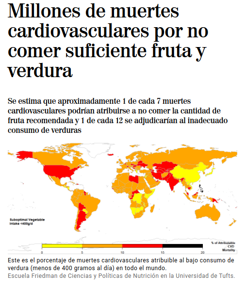
```
]
.pull-right[
- Correlation informs about the association between two variables
- __It cannot tell anything__ about if changes in the values of one variable are due to changes in the values of the other variable.
]

---
# FF (4): Correlation is not agreement

- Correlation and agreement are similar and related concepts but, _although similar and related, __they represent completely different notions of association__. 

- Assessing agreement between variables assumes that the variables measure the same construct, 
- while correlation of variables can be assessed for variables that measure completely different constructs. 

---

# FF (4): Correlation is not agreement

.pull-left[
- _Aorta pulsatility_ is measured in week 0 and week 12 in the same body location in stable patients.

- Both variables are measuring the same (AP) therefore the correlation does not make sense.

- Instead we compute a _concordance coefficient_ (intraclass correlation) which accounts for the repeted measurement effect.
]

.pull-right[
```{r echo=FALSE, out.width="100%", fig.align='center'}
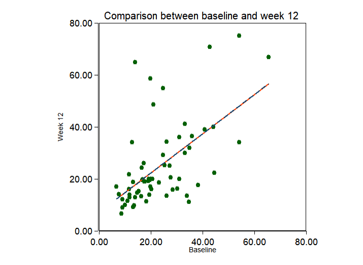
```
]
---

# FF (4): Correlation is not agreement

```{r echo=FALSE, out.width="100%", fig.align='center'}
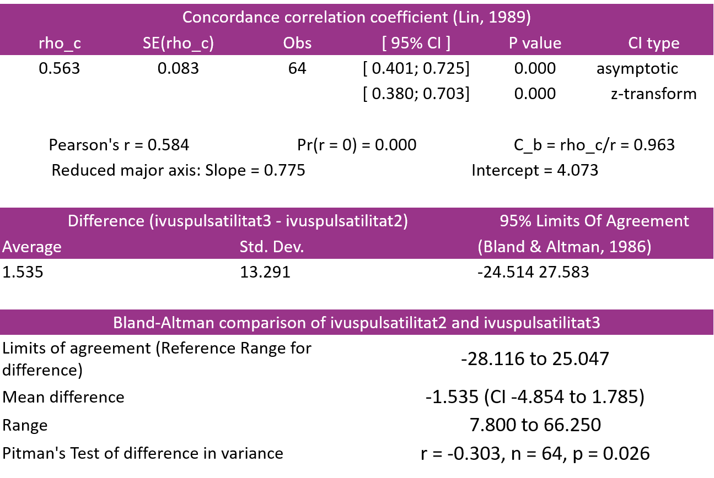
```

---
# FF (4): Correlation is not agreement 

```{r echo=FALSE, out.width="90%", fig.align='center'}
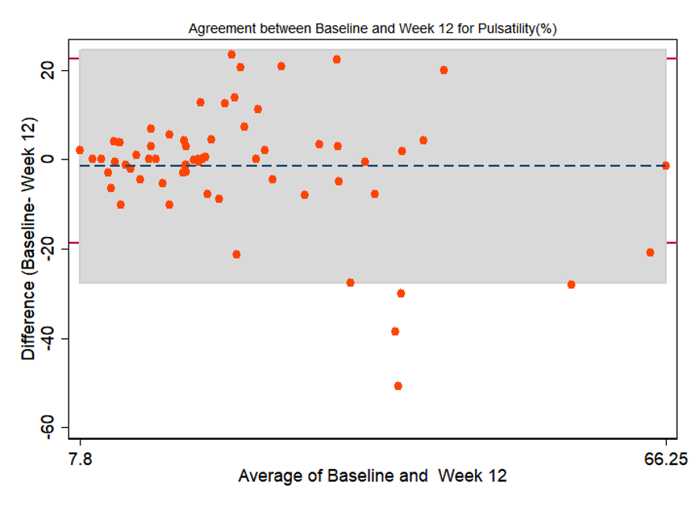
```
---

# Going multivariate

- What about correlation when we deal with several variables simultaneously?
- Obvious step 1: Multiple correlations: every variable vs every other variable.

<br>

```{r echo=FALSE}
library(psych)
cor.glob<- cor (BMI_table3)
lowerMat(cor.glob)
```

---
# Partial correlations

- A good idea: adjust correlation between any 2 variables removing what is explained by their correlation with other variables.>

<br>

```{r echo=FALSE}
library(psych)
par.r <- partial.r(BMI_table3)
lowerMat(par.r)
```


---

# Conclusions and recap

- Correlation is a useful and informative tool to quantify the relation between pairs of variables.
- Distinct situations may require distinct approaches
- If certain assumptions hold, it is possible to compute a p-value for the CC
    - Although it only informs if there is _any_ correlation
    - To estimate _how big_ the correlation is, better use confidence intervals.
- Correlation has many _false friends_
    - Regression, AGreement, Causation, Spureous, ....
    - Learn to know them and to know when to use them.
- Correlation can be extended in many directions
    - More coefficients
    - More dimensions
    
---

# QUESTIONS?

```{r echo=FALSE, out.width="90%", fig.align='center'}

```


```{r, warning = FALSE, comment = NA, message = FALSE, echo = FALSE, eval = FALSE}
# HTML to PDF
library(webshot)
file_name <- paste0("file://", normalizePath("Correlation_and_Association.html"))
webshot(file_name, "Correlation_and_Association.pdf")
```

